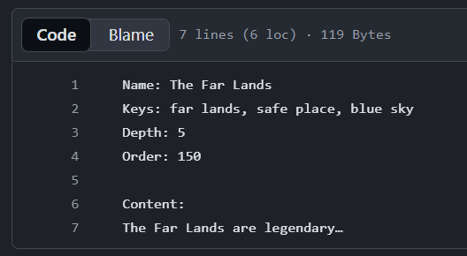

# Lorebook Project

Welcome to the collaborative lorebook project!

This repository allows writers and worldbuilders to create lorebook entries using simple text files.  
You **do not** need programming knowledge — if you can write, you can contribute.

Whenever someone updates an entry, GitHub automatically rebuilds the final Lorebook file.

---

# What This Repository Does

- Contributors write lorebook entries in `.txt` files  
- These files are placed inside the `lorebook_entries/` folder  
- A GitHub Action converts them into a SillyTavern/Chub-ready lorebook  
- A new downloadable version is published automatically  
- No installation or coding required

---

# How to Create or Edit a Lore Entry

All lore entries use a simple text format.

### 📝 Example Entry Format (required fields)


### Required fields
- **Name** — Title of the lore entry  
- **Keys** — Keywords separated by commas  
- **Content** — The main text of the entry  

---

# Optional Fields



Optional fields allow more advanced control, but are **not recommended for most users**.  
If you do not include them, the system will automatically apply safe defaults.

### ▶️ Click to expand optional field reference

<details>
<summary><strong>Optional Parameters and Default Values</strong></summary>

```txt
KeySecondary: []
Constant: false
Vectorized: false
Selective: true
SelectiveLogic: 0
AddMemo: true
Order: 100
Position: 0
Disable: false
IgnoreBudget: false
ExcludeRecursion: false
PreventRecursion: false
MatchPersonaDescription: false
MatchCharacterDescription: false
MatchCharacterPersonality: false
MatchCharacterDepthPrompt: false
MatchScenario: false
MatchCreatorNotes: false
DelayUntilRecursion: false
Probability: 100
UseProbability: true
Depth: 4
OutletName: ""
Group: ""
GroupOverride: false
GroupWeight: 100
ScanDepth: null
CaseSensitive: null
MatchWholeWords: null
UseGroupScoring: null
AutomationId: ""
Role: null
Sticky: 0
Cooldown: 0
Delay: 0
Triggers: []
DisplayIndex: (auto-assigned)
CharacterFilterIsExclude: false
CharacterFilterNames: []
CharacterFilterTags: []
```
> You rarely need these.
> Only modify them when you know exactly what you want to achieve.

</details>

---

# Downloading the Finished Lorebook

Every time new changes are merged, GitHub automatically builds a new lorebook.

You can download it here:

👉 **Releases → Latest Release → `*.json`**

Or use the direct [link](https://github.com/LuDeRu/test-lorebook/releases/latest).

---

# 🤝 How to Contribute (No Coding Needed)

1. Open the `lorebook_entries` folder  
2. Edit an existing entry or create a new `.txt` file  
3. Save your changes by opening a Pull Request  
4. A reviewer will approve and merge your changes  

That’s it!

---

# What Is a Pull Request?

A **Pull Request (PR)** is a simple way to propose changes to the project.

Think of it as:

> “Here’s what I updated — can someone check and confirm it should be added?”

A reviewer looks over the changes to ensure:

- the entry follows the correct format  
- the content fits the world/lore  
- nothing harmful or accidental is included  

After approval, the PR is merged, and the automated system rebuilds the lorebook.

---

# ❓ Q&A

**Q: Do I need special software?**  
No — editing directly on GitHub is enough.

**Q: Can I break something?**  
No. Any issues will be caught during PR review.

**Q: Do I need to use optional fields?**  
No. They are completely optional and **usually not recommended**.

**Q: Where do I download the lorebook?**  
From the [**Releases**](https://github.com/LuDeRu/test-lorebook/releases/latest) tab.  
(We may create automatic Chub uploads in the future.)

**Q: Can the content include line breaks?**  
Yes. Everything after `Content:` is included as-is.

**Q: What if I’m unsure about formatting?**  
Just open a Pull Request — someone will help you adjust it.

---

# 🎉 Thank You for Helping Build the Lorebook!

Every contribution makes the world richer.  
If you're unsure about anything, feel free to ask questions — we're happy to help!
